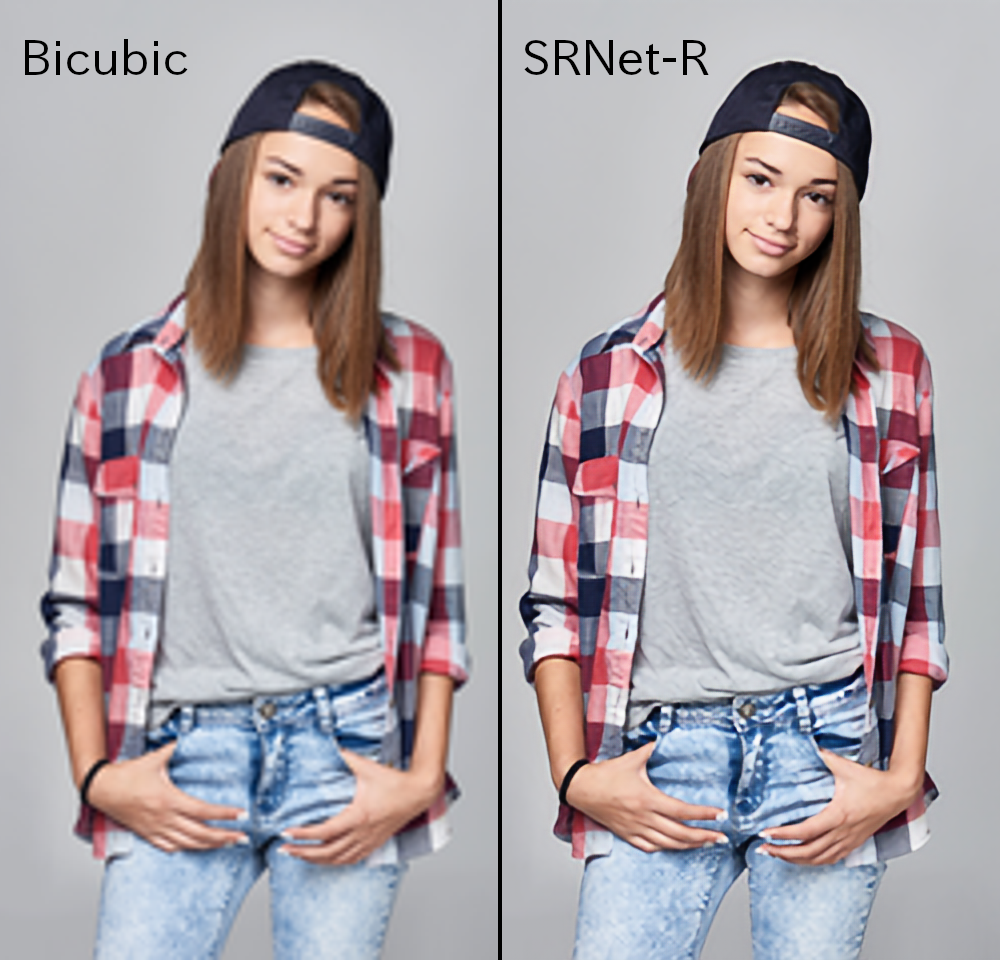
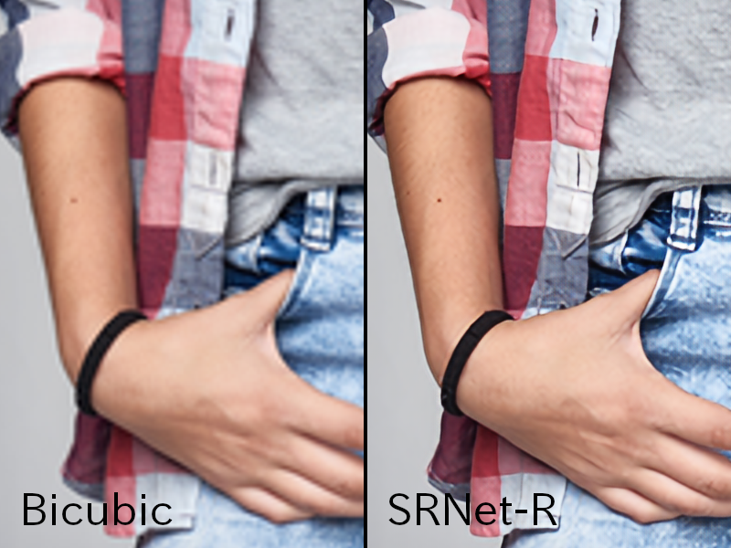
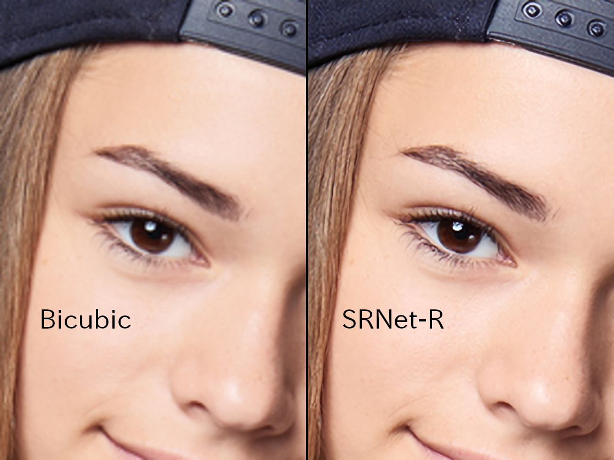

## Super-Resolution Network

- **Partially imported from [tensorlayer/srgan](https://github.com/tensorlayer/srgan).**
- **Using "Group Normalization" layers instead of "Batch Normalization" layers.**
- **Using "Residual in Residual Network".**
- **Using "Swish" activation function instead of "ReLU".**
- **Using Autoencorder's latent space content loss and MAE loss.**

### System Requirements
- **Memory: 12GB RAM**

## Preparation

Install TensorFlow.

Follow the instructions below to install other requirements.
```bash
cd ~/
sudo python3 -m pip install https://github.com/tensorlayer/tensorlayer/archive/master.zip
sudo python3 -m pip install --upgrade tensorlayer
git clone https://github.com/ImpactCrater/SRNet-R.git
sudo python3 -m pip install easydict
sudo apt install python3-tk
```

We run this script under [TensorFlow](https://www.tensorflow.org) 1.12 and the [TensorLayer](https://github.com/tensorlayer/tensorlayer) 1.8.0+.


### My Results

<a href="http://tensorlayer.readthedocs.io">
<div align="center">
	
</div>
</a>

<a href="http://tensorlayer.readthedocs.io">
<div align="center">
	
</div>
</a>

<a href="http://tensorlayer.readthedocs.io">
<div align="center">
	
</div>
</a>
Original image is from iStock.

### Prepare Data

 - You need to have the high resolution images for training and validation.
   -  You can set the path to your training image folder via `config.TRAIN.hr_img_path` in `config.py`.
   -  You can set the path to your validation image folder via `config.VALID.hr_img_path` in `config.py`.
   -  Subdirectories are searched recursively.

### You can use pre-trained model and re-train it.
 1. Download the [ZIP file from the file storage(Yahoo! JAPAN)](https://yahoo.jp/box/x9Zq_r).
 1. Unzip it.
 1. Move 2 files 'ae.npz', 'g.npz' into './SRNet-R/checkpoint/'.
 1. Run.

### Run

#### Start training.

```bash
python main.py
```

#### Start evaluation.
 - After training, if you want to test the model, You need to put the image in the specified folder.
   -  You can set the path to your test image folder via `config.VALID.eval_img_path` in `config.py`.
   -  You can set the name of your test image via `config.VALID.eval_img_name` in `config.py`.(Default; "1.png")
  

```bash
python main.py --mode=evaluate 
```

### License

- For academic and non-commercial use only.
- For commercial use, please contact tensorlayer@gmail.com.
